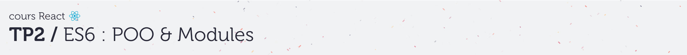
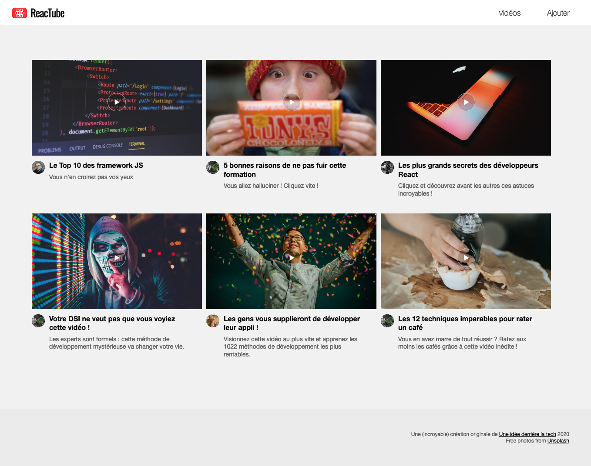

# A. Préparatifs <!-- omit in toc -->

## Sommaire <!-- omit in toc -->
- [A.1. Récupération du projet](#a1-récupération-du-projet)
- [A.2. Lancement de l'application](#a2-lancement-de-lapplication)


## A.1. Récupération du projet
**Ce repo contient une solution commentée du précédent TP.** <br>
Pour ce TP vous pouvez soit repartir de vos fichiers du précédent TP (si vous l'aviez terminé et que le formateur a validé que tout était correct notamment au niveau de la config Babel et webpack) ou bien fork+clone ce repo et vous en servir comme base pour ce TP.

*Si vous repartez de vos fichiers, **pensez à faire un `git pull`** pour récupérer les dernières modifications du repo (probablement des modifs de CSS ou des corrections de dernière minute).*

1. **Commencez par faire un fork du TP :**
	- soit en cliquant sur le bouton `"Créer une divergence"` (_`"Fork"` sur la version anglaise de gitlab_)
	- soit en vous rendant directement sur https://framagit.org/cours-react/tp2/-/forks/new

	**⚠️ ATTENTION :** Choisissez de placer le fork **dans votre profil utilisateur** et vérifiez que le repo est **bien en mode "privé"**

2. **Ajoutez moi en tant que "reporter" pour que j'ai accès à votre code :** dans le menu de gauche, cliquez que `"Membres"`, et entrez `@tf` comme nom d'utilisateur, et donc `"reporter"` comme rôle.

3. **Récupérez ensuite les fichiers de ce TP grâce à Git : clonez votre fork dans un dossier de votre choix** :
	```bash
	mkdir ~/tps-react
	git clone https://framagit.org/<votre-username>/tp2.git ~/tps-react/tp2
	```
	> _**NB :** Comme pour le TP1, ici je clone dans mon dossier `/home/thomas/tps-react/tp2`. **Si vous êtes sous windows faites attention au sens des slashs et au caractère `"~"`** qui représente le dossier de l'utilisateur sur système unix. Si vous êtes sous windows utilisez **Git bash** (qui comprend cette syntaxe) ou si vous tenez vraiment à utiliser **cmd** pensez à adapter !_

	> _**NB2 :** Comme pour le TP1 aussi, si vous préférez **cloner en SSH** pour ne pas avoir à taper votre mot de passe à chaque fois, renseignez votre clé SSH dans votre [compte utilisateur gitlab](https://framagit.org/profile/keys) et clonez à partir de cette URL : `git@framagit.org:cours-react/tp2.git`_

4. **Ouvrez le projet dans VSCodium** (pour les différentes façon d'ouvrir le projet relisez les [instructions du TP1](https://framagit.org/cours-react/tp1/-/blob/master/A-preparatifs.md#a3-ouvrir-le-projet-dans-vscodium) )
	```bash
	codium ~/tps-react/tp2
	```

5. **Installez les paquets npm nécessaires au projet** notamment le compilateur [Babel](https://babeljs.io).<br>
	Ouvrez un terminal intégré à VSCodium (<kbd>CTRL</kbd>+<kbd>J</kbd> *(PC)* / <kbd>CMD</kbd>+<kbd>J</kbd> *(Mac)*) et tapez juste :
	```bash
	npm install
	```

	> _**NB :** Vous noterez qu'on ne précise pas les paquets à installer. npm va en effet les déterminer **automatiquement** à partir du contenu du fichier `package.json` et plus particulièrement à partir des sections `"dependencies"` et `"devDependencies"` qui indiquent quels sont les paquets qui ont été installés précédemment._
	>
	> **Magique !** 🙌


## A.2. Lancement de l'application

Comme dans le précédent TP lancez un serveur HTTP et la compilation du projet dans deux terminaux côte à côte ([terminaux splittés](https://code.visualstudio.com/docs/editor/integrated-terminal#_terminal-splitting)) :

1. **Lancez un serveur http** dans un terminal intégré de VSCodium (<kbd>CTRL</kbd>+<kbd>J</kbd> *(PC)* / <kbd>CMD</kbd>+<kbd>J</kbd> *(Mac)*) :
	```bash
	npx serve -l 8000
	```

2. **Lancez la compilation de votre projet** dans un **deuxième** [terminal splitté](https://code.visualstudio.com/docs/editor/integrated-terminal#_terminal-splitting) (*le `watch` et `npx serve` doivent tourner en parallèle*) :
	```bash
	npm run watch
	```

3. **Vérifiez dans le navigateur que la page index.html s'affiche correctement** en ouvrant l'url http://localhost:8000.

	Le résultat attendu est le suivant :

	

	> _**NB : Si la page ne s'affiche pas correctement**, vérifiez que vous avez bien lancé le serveur http dans le dossier du projet, c'est à dire celui où se trouve le fichier `index.html`. Puis vérifiez dans la `Console` ou dans l'onglet `Sources` (Chrome) ou `Debugger` (Firefox) qu'l n'y a pas d'erreur JS lorsque la page se charge._

## Étape suivante <!-- omit in toc -->
Si tout fonctionne, vous pouvez passer à l'étape suivante : [B. La POO](B-poo.md)