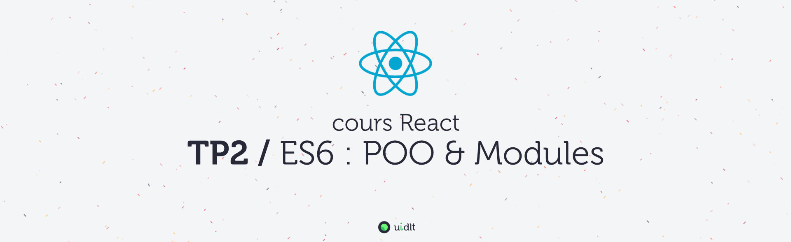

## Objectifs
- Maîtriser les syntaxes de la POO en ES6+
- Répartir son code dans plusieurs fichiers grâce aux modules et à Webpack

## Sommaire
Pour plus de clarté, les instructions du TP se trouvent dans des fichiers distincts (un fichier par sujet), procédez dans l'ordre sinon, ça fonctionnera beaucoup moins bien !

1. [A. Préparatifs](A-preparatifs.md)
2. [B. La POO](B-poo.md)
3. [C. Modules](C-modules.md)
4. [D. POO avancée](D-poo-avancee.md)
